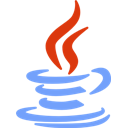

```java
package io.github.ichocomilk.me;

public final class iChocoMilk {

    private static final iChocoMilk REAL = new iChocoMilk();

    public String getInfo() {
        return
            """
            Programming/Scripting languages:
                Java - 2022
                Go - 2024
                Lua - 2024
                Arduino - 2024

            General:
                TCP/Ip, json, toml, yaml, optimization, git, github,
                profiling, http and logic 😎

            Java:
                Maven, gson, apache commons, net.minecraft.server,
                spigot api, visualvm, tinylog, netty and more

            Go:
                Standard libraries
            """;
    }
    public static iChocoMilk getReal() {
        return REAL;
    } 
}
```
```go
package overflow

import "fmt"

func main() {
    fmt.Println("My brain is burning 🧠🔥")
    main()
}
```

<h2>Favorites Programming languages:</h2>
<a href="https://www.azul.com/products/prime/" target=”_blank”>
        
</a>
<a href="https://go.dev/" target=”_blank”>
        
</a>
